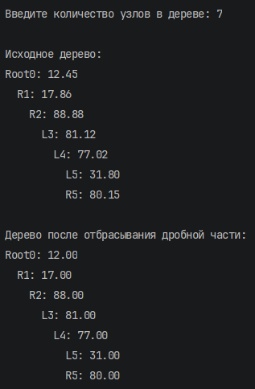
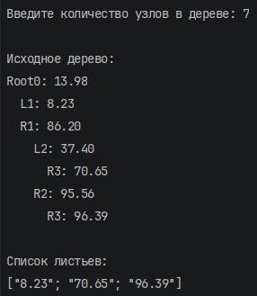

# Никифоров Егор КМБ\_2 Лабораторная №4

## Задание 1

### Текст задачи

Дерево содержит вещественные числа. Отбросить в каждом из них дробную часть.

### Алгоритм решения

1. Определение типа дерева
Бинарное дерево описывается размеченным объединением:

    Empty – пустое поддерево

    Node – узел, содержащий значение (float), левое и правое поддеревья.

2. Функция вставки insert
Рекурсивно вставляет новое значение в дерево, сохраняя свойство BST:

    Если дерево пусто, создаётся узел-лист.

    Если значение меньше корня, вставляется в левое поддерево.

    Иначе (больше или равно) – в правое поддерево.
    Возвращается новое дерево, исходное не изменяется.

3. Генерация случайного дерева generateRandomTree
Пользователь вводит количество узлов. Функция рекурсивно добавляет указанное число случайных чисел (от 0 до 100) в изначально пустое дерево с помощью insert. Таким образом, получается бинарное дерево поиска произвольной формы (несбалансированное).

4. Функция treeMap
Рекурсивно обходит дерево и применяет переданную функцию к каждому узлу, возвращая новое дерево с той же структурой. Для пустого дерева возвращает Empty.

5. Ввод данных
Функция readInt запрашивает у пользователя целое положительное число и повторяет ввод до получения корректного значения.

6. Вывод дерева
Функция printTreeDepth выводит дерево, показывая глубину и направление (Root, L, R) для каждого узла. Отступы увеличиваются с глубиной, что позволяет визуально оценить структуру.

7. Основная программа

    Запрашивается количество узлов.

    Генерируется исходное дерево и выводится.

    С помощью treeMap применяется функция truncate (отбрасывание дробной части) ко всем значениям.

    Результирующее дерево выводится.

### Тестирование

## Задание 2

### Текст задачи

Сформировать список из узлов, являющихся листьями (узел считается листом, если у него нет ни левого, ни правого поддерева).

### Алгоритм решения

1. Тип дерева – тот же, что и в задании 1.

2. Функция свёртки foldTree
Это обобщённая рекурсивная функция, которая принимает:

    nodeF – функцию, обрабатывающую узел: получает значение узла и результаты свёртки левого и правого поддеревьев.

    empty – значение для пустого дерева.

    tree – обрабатываемое дерево.
    Возвращает результат свёртки. Обход выполняется в порядке: левое поддерево, правое, затем узел.

3. Функция leaves
Использует foldTree для сбора листьев:

    Начальное значение empty – пустой список [].

    Функция nodeF получает значение узла v и списки листьев из левого и правого поддеревьев.

        Если оба списка пусты, значит, узел не имеет потомков – он лист, возвращается [v].

        Иначе возвращается объединение списков из поддеревьев (значение узла не добавляется, так как он не лист).

4. Генерация дерева, ввод данных и вывод дерева – полностью аналогичны заданию 1.

5. Вывод списка листьев
Полученный список чисел форматируется с двумя знаками после запятой и выводится.

### Тестирование

