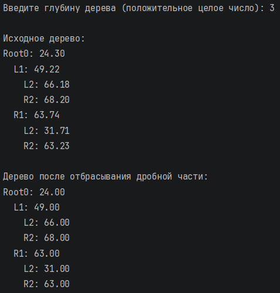
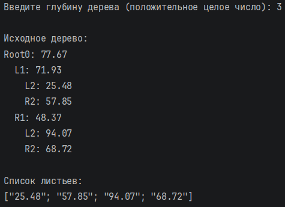

# Никифоров Егор КМБ\_2 Лабораторная №4

## Задание 1

### Текст задачи

Дерево содержит вещественные числа. Отбросить в каждом из них дробную часть.

### Алгоритм решения

1. Определяем рекурсивный тип бинарного дерева:

    Empty – пустое поддерево.

    Node – узел, содержащий вещественное число, левое и правое поддеревья.

2. Реализуем функцию treeMap, которая рекурсивно обходит дерево и применяет переданную функцию к каждому значению, сохраняя структуру:

    для пустого дерева возвращается Empty;

    для узла строится новый узел с преобразованным значением и результатами рекурсивного применения treeMap к левому и правому поддеревьям.

3. Функция readInt запрашивает у пользователя положительное целое число (глубину) и повторяет ввод до получения корректного значения.

4. Генерация случайного дерева:

    используется генератор случайных чисел Random;

    функция generateRandomTree depth создаёт полное бинарное дерево заданной глубины, где каждый узел содержит случайное число от 0 до 100.

5. Вывод дерева осуществляется функцией printTreeDepth, которая рекурсивно обходит дерево и печатает каждый узел с отступом, показывающим глубину, и меткой направления (Root, L, R). Это позволяет наглядно представить структуру.

6. В основной программе:

    запрашивается глубина;

    генерируется исходное дерево и выводится;

    применяется treeMap с функцией truncate (отбрасывает дробную часть);

    выводится преобразованное дерево.

### Тестирование

## Задание 2

### Текст задачи

Сформировать список из узлов, являющихся листьями (узел считается листом, если у него нет ни левого, ни правого поддерева).

### Алгоритм решения

1. Используется тот же тип Tree, что и в первом задании.

2. Реализуется функция свёртки foldTree:

    принимает функцию nodeF, обрабатывающую узел (значение и результаты свёртки левого и правого поддеревьев), значение для пустого дерева empty и само дерево;

    рекурсивно обходит дерево, возвращая результат.

3. Функция leaves использует foldTree для сбора листьев:

    начальное значение empty – пустой список [];

    функция nodeF проверяет, являются ли списки из левого и правого поддеревьев пустыми. Если да, значит текущий узел – лист, и возвращается список с его значением [v]. Иначе объединяются списки из поддеревьев (значение узла не добавляется).

4. Ввод глубины, генерация и вывод дерева аналогичны первому заданию.

5. После вывода дерева вызывается leaves, полученный список листьев преобразуется в список строк с двумя знаками после запятой (для красивого отображения) и выводится.

### Тестирование

